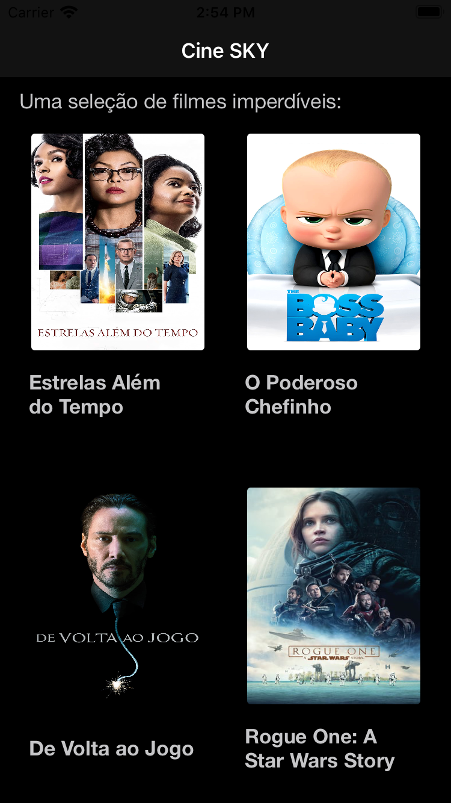
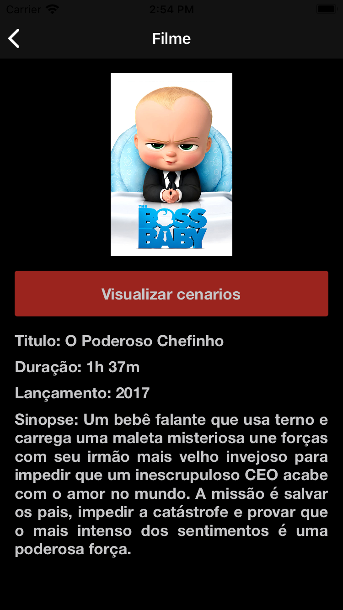
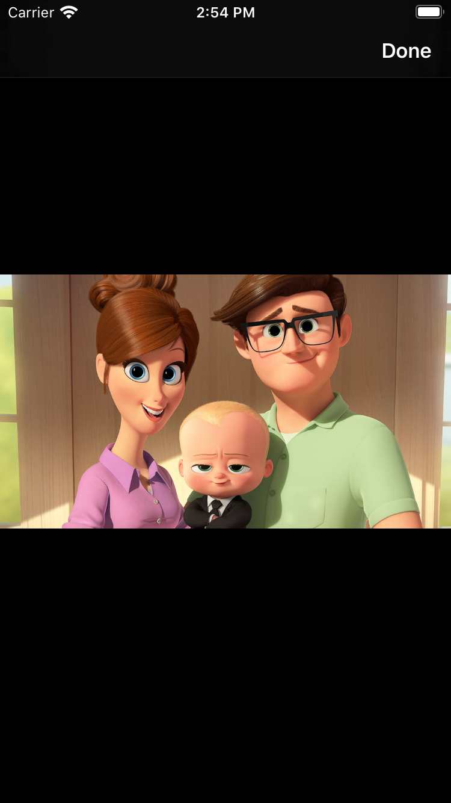

# Sky Challenge

[Link do desafio](https://github.com/VitorNevess/sky-digital-swift/blob/master/SKY%20%E2%80%93%20Mobile%20Test.pdf)

## Feed

## Filme selecionado

## Cenas do filme selecionado

---
### Detalhes e requisitos:
-  Xcode 11.2
-  Swift 5
-  CocoaPods 1.5.3

---
### Bibliotecas utilizadas:
- `Alamofire` Requisições HTTP
- `Cartography` Auto Layout
- `ImageSlideShowSwift` Apresentação de imagens
- `JGProgressHUD` Indicador de loading

---
### Arquitetura:
O projeto foi feito em MVC, a estrutura de arquivos é baseada em três camadas principais, mais o Coordinator:
- *Model: Contém os objetos utilizados na requisição e nas views.
- *View: Contém as views do app.
- *Controller: Faz o gerenciamento entre a view e a model.
- *Coordinator: Faz o gerenciamento de navegação de telas.
